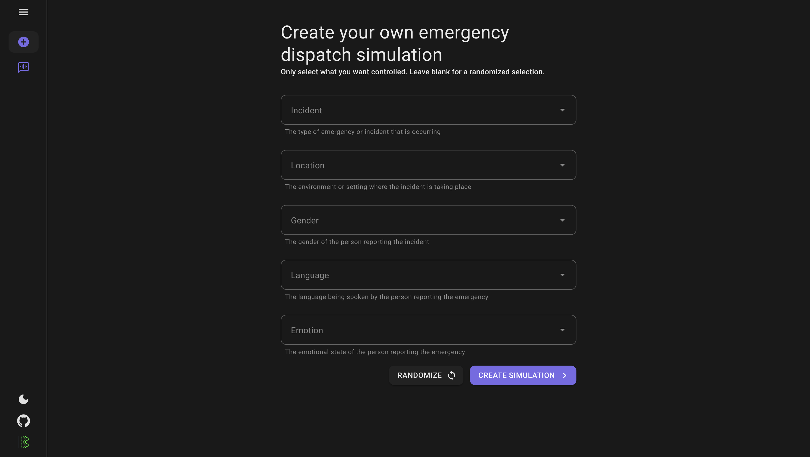
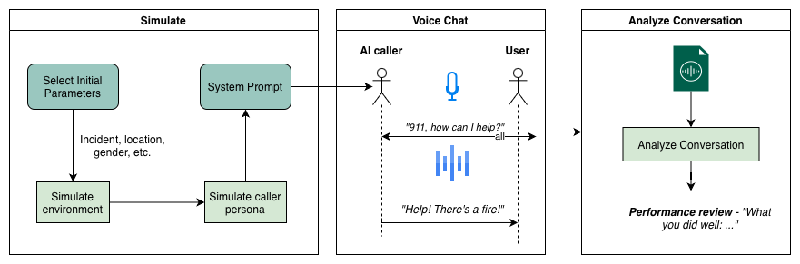

# Emergency Dispatch Simulator

A web-based training platform for 911 operators, designed to simulate real emergency call scenarios. The simulator provides an immersive, interactive environment where trainees can practice responding to a wide range of situations with realistic voices, emotions, and stress levels.

This system uses the [Higgs audio understanding and generation models](https://www.boson.ai) to simulate and analyze voice conversations.



## Workflow


### Simulate
The system begins by generating a realistic emergency scenario.
- Select Initial Parameters: Choose incident type, location, caller gender, and other contextual variables.
- Simulate Environment & Caller Persona: The system crafts an immersive situation and caller profile, including emotional state and speaking style.
- System Prompt Generation: These parameters are combined into a structured prompt to guide the AI caller’s behavior during the conversation.

### Voice Chat
A real-time, two-way voice conversation takes place between the AI caller and the user (dispatcher).
- The user can begin with an opening line such as “911, how can I help?”
- The AI responds naturally based on the given scenario.
- The model continues the dialogue, modulating tone, urgency, and emotion dynamically to simulate authentic call flow.

### Analyze Conversation
Once the call ends:
- The system transcribes the full dialogue.
- An analysis module evaluates performance — response times, empathy, accuracy, and procedural adherence.
- A performance review summarizes key insights.

## Getting Started
### Prerequisites
Before running locally, make sure you have:
- Docker installed and running
- API keys and configuration for Boson models (store them in a .env file in the project root)

### Running Locally
```bash
# Clone the repository
git clone https://github.com/your-username/emergency-dispatch-simulator.git
cd emergency-dispatch-simulator

# Build and run the containers
docker compose up --build
```

Then open your browser and navigate to:
```bash
http://localhost:8080
```